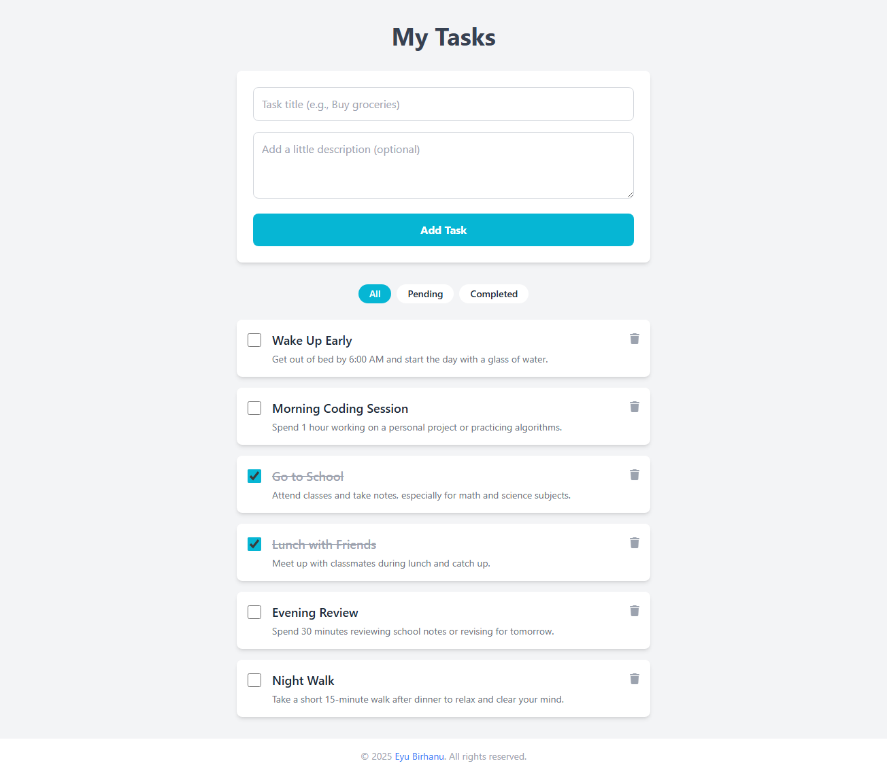

# Internship Challenge: Frontend Task Manager

This repository contains the solution for the Frontend Developer track of the Internship Entrance Challenge. The application is a simple yet functional task manager built with React, Vite, and Tailwind CSS.



## ✨ Features

- **Create, Read, Update, Delete (CRUD):** Full task management functionality.
- **Task Descriptions:** Add detailed descriptions to your tasks.
- **"See More/Less":** Long descriptions are truncated with an option to expand.
- **Filtering:** View tasks by "All," "Pending," and "Completed" status.
- **Responsive Design:** A clean, mobile-first interface that looks great on all screen sizes.
- **Component-Based:** Built with a professional, reusable component structure.

## 🛠️ Tech Stack

- **Framework:** React (with Vite)
- **Styling:** Tailwind CSS
- **Icons:** Font Awesome

## 🚀 How to Run Locally

Follow these steps to get the project running on your local machine.

1.  **Clone the Repository**

    ```bash
    git clone https://github.com/eyuBirhanu/frontend.git
    cd frontend
    ```

2.  **Navigate to the Project Directory**
    The application code resides in the `frontend` folder.

    ```bash
    cd frontend
    ```

3.  **Install Dependencies**
    This will install all the necessary packages for the project.

    ```bash
    npm install
    ```

4.  **Start the Development Server**

    ```bash
    npm run dev
    ```

5.  **View the Application**
    Open your browser and navigate to `http://localhost:5173`. The application will be running live.
